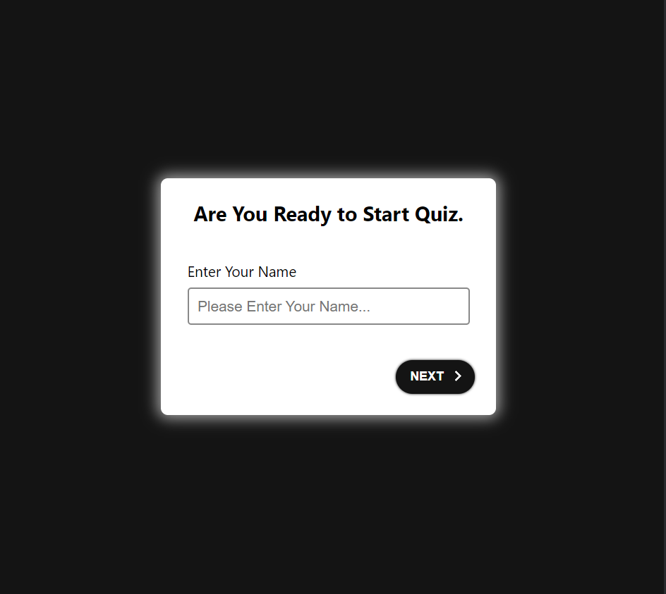

# POS-Quiz-FullStack-App

### images

### About

A simple FullStack Quiz Application that helps the students practice categorizing a set of words according to their part of speech.

### Technology

This app is Built with TypeScript
Front-End: (React Js)
Back-end: (Node JS, Express.js)

### Setup

To Run the App you will find A "Readme.md" file in "Server" And "Client" Folders on how you can set up the app.
